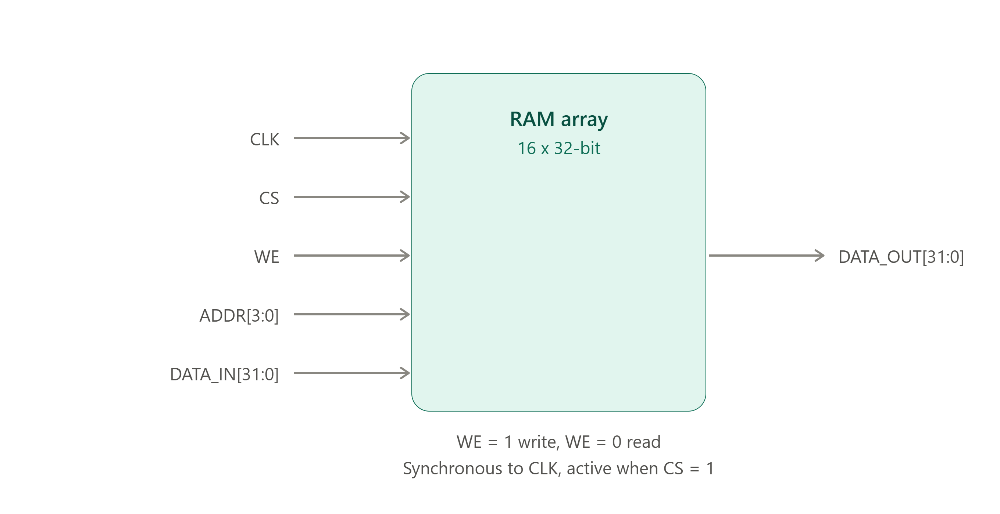
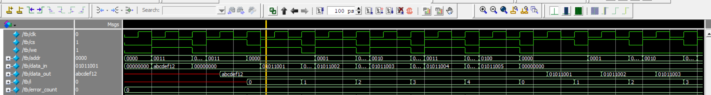
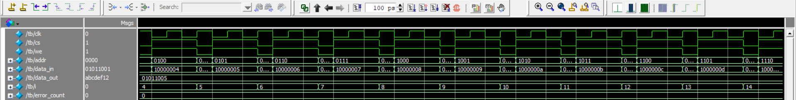
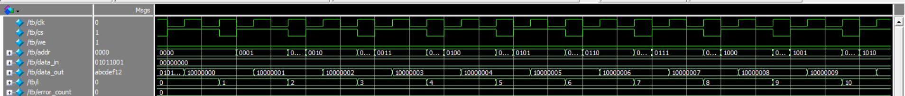
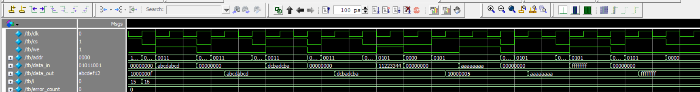

# Single-Port Synchronous RAM using Verilog HDL

## Project Overview

This project implements a **parameterized single-port synchronous RAM (SPRAM)** using **Verilog HDL**.

The RAM supports synchronous read and write operations using a single memory access port. The design is written with a simple, synthesizable RTL coding style suitable for **FPGA/ASIC memory inference**.

A directed Verilog testbench is developed to verify the RAM functionality using multiple test cases including single read/write, multiple accesses, full memory access, overwrite, and chip-select disable conditions.

---

## Architecture



---

## Design Specifications

| Parameter           |        Value |
| ------------------- | -----------: |
| Address Width       |       4 bits |
| Data Width          |      32 bits |
| Memory Depth        | 16 locations |
| Memory Organization |      16 × 32 |
| Total Capacity      |     512 bits |
| Total Capacity      |     64 Bytes |
| Read Type           |  Synchronous |
| Write Type          |  Synchronous |
| Memory Port         |  Single Port |

---

## 🔌 Interface Signals

| Signal     | Direction | Description                 |
| ---------- | --------- | --------------------------- |
| `clk`      | Input     | System clock                |
| `cs`       | Input     | Chip Select / Memory Enable |
| `we`       | Input     | Write Enable                |
| `addr`     | Input     | Memory address              |
| `data_in`  | Input     | Data to be written          |
| `data_out` | Output    | Data read from memory       |

### Control Operation

| CS | WE | Operation    |
| -: | -: | ------------ |
|  0 |  X | RAM disabled |
|  1 |  0 | Read         |
|  1 |  1 | Write        |

---

## Working Principle

### Write Operation

When:

```text
CS = 1
WE = 1
```

the data at `data_in` is written into the selected memory location at the rising edge of `clk`.

```verilog
mem[addr] <= data_in;
```

Example:

```text
CS      = 1
WE      = 1
ADDR    = 5
DATA_IN = 11223344
```

At the rising clock edge:

```text
MEM[5] = 11223344
```

---

### Read Operation

When:

```text
CS = 1
WE = 0
```

the selected memory location is read at the rising edge of the clock.

```verilog
data_out <= mem[addr];
```

Because the read operation occurs inside:

```verilog
always @(posedge clk)
```

the RAM provides a **synchronous read**.

---

### Chip Select Disabled

When:

```text
CS = 0
```

the RAM does not perform a read or write operation.

This ensures that:

* Memory contents are preserved.
* Write operation is blocked.
* Read operation is blocked.
* The registered output retains its previous value.

---

# RTL Implementation

The RAM is implemented using a parameterized memory array:

```verilog
reg [DATA_WIDTH-1:0] mem [0:DEPTH-1];
```

The main sequential logic is:

```verilog
always @(posedge clk) begin
    if (cs) begin
        if (we)
            mem[addr] <= data_in;
        else
            data_out <= mem[addr];
    end
end
```

This coding style is simple and suitable for synthesis and memory inference.

---

# Verification

A directed Verilog testbench is used to verify the RAM.

The testbench uses:

* Clock generation
* Write task
* Read task
* Expected-data checking
* Error counter
* Multiple directed test cases
* PASS/FAIL messages

---

## Test Cases

### TC1 - Single Write

Writes one data value to a single memory address.

```text
Address = 3
Data    = ABCDEF12
```

Expected:

```text
MEM[3] = ABCDEF12
```

Result:

```text
PASS
```

---

### TC2 — Single Read

Reads the previously written address.

```text
Address = 3
Expected = ABCDEF12
```

Result:

```text
PASS READ
```

---

### TC3 — Five Writes

Writes different data to five memory locations.

```text
Address     Data
0           01011001
1           01011002
2           01011003
3           01011004
4           01011005
```

Result:

```text
PASS
```

---

### TC4 — Five Reads

Reads the five previously written locations and compares the output against expected values.

Result:

```text
PASS READ
```

---

### TC5 — Full Memory Write

All 16 memory locations are written.

```text
Address 0  → 10000000
Address 1  → 10000001
Address 2  → 10000002
...
Address 15 → 1000000F
```

Result:

```text
PASS
```

---

### TC6 — Full Memory Read

All 16 memory locations are read and compared against the expected data.

Result:

```text
ALL READS PASS
```

---

### TC7 — Overwrite Test

An existing memory location is written with new data.

Example:

```text
First write:
Address = 3
Data    = ABCDABCD

Second write:
Address = 3
Data    = DCBADCBA
```

The second write must replace the first value.

Result:

```text
PASS
```

---

### TC8 — CS Disabled Write

First, known data is written to an address.

Then a write is attempted with:

```text
CS = 0
```

The original memory value must remain unchanged.

Example:

```text
Original:
MEM[5] = 11223344

Attempted write with CS=0:
MEM[5] ← DEADBEEF
```

Expected:

```text
MEM[5] = 11223344
```

Result:

```text
CS=0 WRITE TEST PASSED
```

---

### TC9 — CS Disabled Read

A read is attempted while:

```text
CS = 0
```

No new memory read should occur and the registered `data_out` should retain its previous value.

Result:

```text
CS=0 READ TEST PASSED
```

---

### TC10 — Data Pattern Test

The following data patterns are tested:

```text
00000000
FFFFFFFF
AAAAAAAA
55555555
```

These patterns help verify different bit combinations across the complete 32-bit data bus.

---

# Simulation Results

The simulation successfully verifies:

```text
✓ Single Write
✓ Single Read
✓ Five Writes
✓ Five Reads
✓ Full Memory Write
✓ Full Memory Read
✓ Overwrite
✓ CS=0 Write Protection
✓ CS=0 Read
✓ Data Pattern Testing
```

Final simulation result:







```text
ALL TEST CASES PASSED
ERROR COUNT = 0
```

---

# Timing

The RAM uses a **10 ns clock period** in the testbench.

```text
Clock Period = 10 ns

Frequency = 1 / 10 ns

          = 100 MHz
```

Testbench inputs are changed at the falling edge:

```verilog
@(negedge clk);
```

and the RAM samples them at:

```verilog
@(posedge clk);
```

This provides stable inputs before the DUT's active clock edge and helps avoid race conditions in the testbench.

---

# Tools Used

* Verilog HDL
* QuestaSim / ModelSim
* GTKWave (optional)
* Xilinx Vivado (for synthesis/memory inference)
* Git
* GitHub

---

# Project Structure

```text
single-port-sync-ram/
│
├── rtl/
│   └── single_port_sync_ram.v
│
├── tb/
│   └── single_port_ram_tb.v
│
├── sim/
│   └── waveform.png
│
└── README.md
```

---

# Key Learning Outcomes

* Understanding single-port RAM architecture
* Synchronous read and write operations
* Memory array implementation in Verilog
* Chip Select and Write Enable control
* Parameterized RTL design
* Memory address and data organization
* Testbench task-based verification
* Directed test case development
* PASS/FAIL checking
* Full memory verification
* Overwrite testing
* Enable/Chip Select testing
* Basic waveform analysis
* Synthesizable RAM coding style

---

# Possible Future Improvements

The project can be extended with:

* Randomized read/write testing
* Functional coverage
* SystemVerilog assertions
* Scoreboard/reference model
* SystemVerilog/UVM verification environment
* Read-during-write behavior testing
* Different memory depths and data widths
* FPGA block RAM implementation
* Memory initialization
* Formal verification

---

# Project Type

**RTL Design + Functional Verification**

**Language:** Verilog HDL

**Memory:** Single-Port Synchronous RAM

**Verification:** Directed Testbench

---
